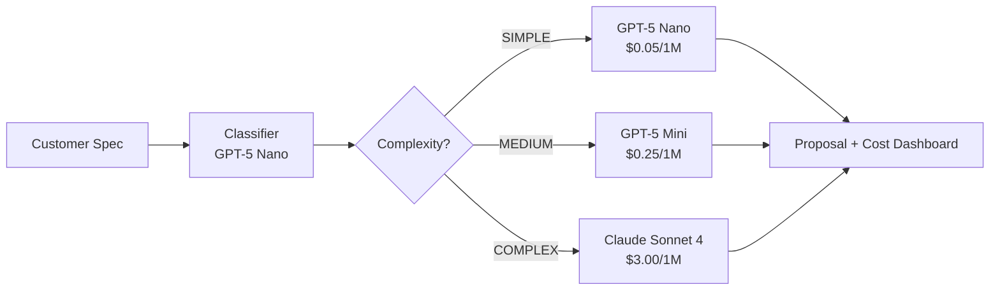

# AI Spec-to-Proposal Router


> **Intelligent model routing engine** that analyzes customer specifications, scores complexity, and routes each request to the most cost-effective LLM. Includes a real-time token cost dashboard.

`97% cost reduction` | `3-tier routing` | `Real-time dashboard` | `PDF export`


---

## What It Does

Instead of sending every request to an expensive flagship model, this system uses a **cheap classifier** to analyze each request's complexity first, then routes it to the optimal model:

- **Simple requests** (standard specs) → cheapest model (~$0.0005/request)
- **Medium requests** (multi-parameter) → mid-tier model (~$0.003/request)
- **Complex requests** (system integration) → powerful model (~$0.02/request)

Result: **up to 97% cost savings** compared to a single-model approach.

---

## Architecture



---

## Features

- **3-Tier Model Routing** — Complexity-based routing to GPT-5 Nano, GPT-5 Mini, or Claude Sonnet 4
- **16-Product Photonics Catalog** — Fuzzy matching across wavelengths, power, applications, and features
- **Token Economy Dashboard** — Interactive Plotly chart comparing costs across 5 models
- **Technical Feasibility Matrix** — Green/yellow/red status per requirement parameter
- **PDF Export** — Professional proposal document with Unicode support
- **Webhook / CRM Integration** — Simulated webhook trigger for downstream automation
- **Privacy Compliance** — PII scrubber step before API calls
- **Demo Mode** — Full functionality without API keys (3 pre-built proposals)

---

## Quick Start

```bash
# Clone the repository
git clone https://github.com/YOUR_USERNAME/spec-to-proposal-router.git
cd spec-to-proposal-router

# Install dependencies
pip install -r requirements.txt

# Run in demo mode (no API keys needed)
streamlit run app.py
```

### Live Mode (optional)

```bash
# Copy and fill in your API keys
cp .env.example .env
# Edit .env with your OPENAI_API_KEY and ANTHROPIC_API_KEY

# Run with live API calls
streamlit run app.py
# Then toggle "Demo Mode" off in the sidebar
```

---

## Project Structure

```
spec-to-proposal-router/
├── app.py                  # Streamlit main application
├── products.py             # 16-product photonics catalog + search engine
├── pricing.py              # Token pricing models (5 LLMs)
├── agents/
│   ├── classifier.py       # GPT-5 Nano complexity classifier
│   ├── router.py           # Model routing logic
│   └── proposal.py         # Proposal generator + 3 mock proposals
├── utils/
│   ├── cost_calculator.py  # Token cost comparison utilities
│   ├── export.py           # PDF export with fpdf2
│   └── pdf_parser.py       # PDF text extraction (PyMuPDF)
├── styles/
│   └── custom.css          # Custom Streamlit theme (1000+ lines)
├── docs/
│   └── architecture.md     # Detailed architecture documentation
├── .streamlit/
│   └── config.toml         # Streamlit theme configuration
├── .env.example
├── requirements.txt
└── README.md
```

---

## How It Works

### 1. Complexity Classification

Every incoming customer specification is first analyzed by a cheap classifier (GPT-5 Nano at $0.05/1M tokens). The classifier categorizes the request into three tiers:

| Tier | Triggers | Model | Cost/1M tokens |
|------|----------|-------|----------------|
| **SIMPLE** | Standard wavelength, clear power spec | GPT-5 Nano | $0.05 input / $0.40 output |
| **MEDIUM** | Multiple parameters, noise specs, multi-wavelength | GPT-5 Mini | $0.25 input / $2.00 output |
| **COMPLEX** | System integration, THz, custom solutions | Claude Sonnet 4 | $3.00 input / $15.00 output |

### 2. Product Matching

A keyword-based search engine scores each of the 16 products in the catalog against the customer specification. Matching dimensions include:

- Wavelength (exact + range matching)
- Power requirements (mW and W)
- Application keywords
- Feature matching
- Product-specific keywords
- THz frequency matching

### 3. Token Economy

The dashboard visualizes the cost comparison across all 5 models for the same token count, showing exactly how much the routing approach saves compared to always using the most expensive model.

---

## Configuration

### Custom Product Catalog

Replace `products.py` with your own product catalog. Each product is a dictionary with:

```python
{
    "id": "unique-id",
    "name": "Product Name",
    "category": "Product Category",
    "type": "laser",  # or "terahertz"
    "wavelengths": [532, 1064],
    "power_range_mw": [100, 5000],
    "applications": ["Microscopy", "Spectroscopy"],
    "key_features": ["Feature 1", "Feature 2"],
    "keywords": ["keyword1", "keyword2"],
}
```

### Model Pricing

Update `pricing.py` to match your LLM provider's current pricing.

---

## Tech Stack

| Component | Technology |
|-----------|-----------|
| Frontend | Streamlit |
| Classifier | OpenAI GPT-5 Nano |
| Medium Tier | OpenAI GPT-5 Mini |
| Complex Tier | Anthropic Claude Sonnet 4 |
| Charts | Plotly |
| PDF Export | fpdf2 |
| PDF Parsing | PyMuPDF (fitz) |

---

## License

MIT License — see [LICENSE](./LICENSE) for details.
